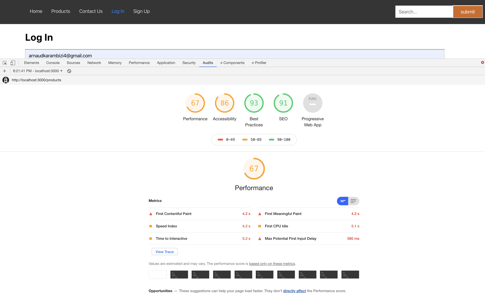
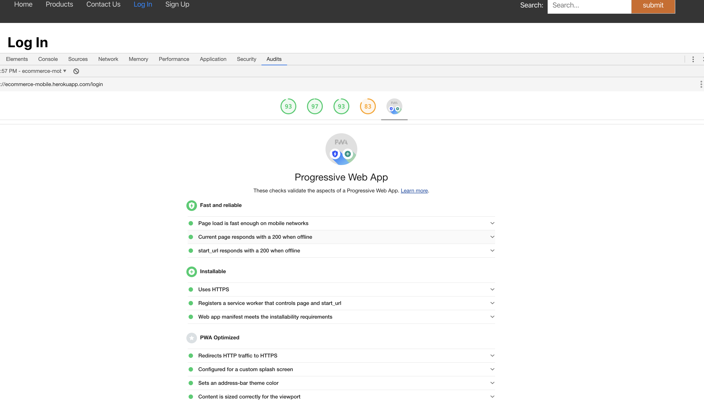
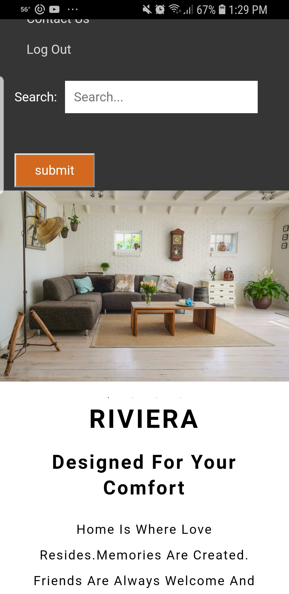
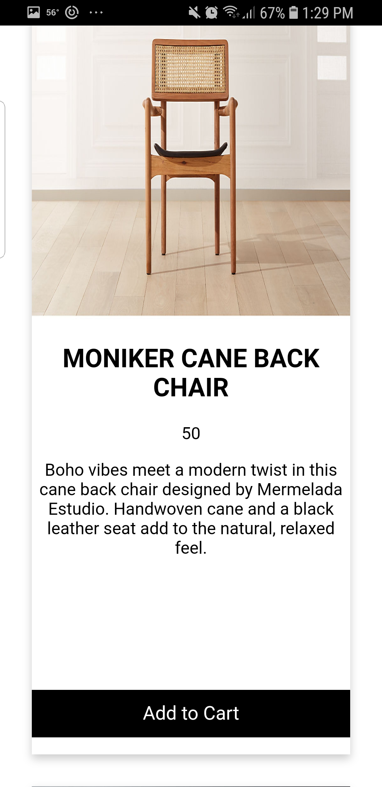

# E-Commerce Mobile App

Technologies used to make the project.

-   React.js
-   Node.js + Express + Mongoose
-   JSON Web Token authentication

npm packages used.

-   helmet
-   morgan
-   express
-   Mongoose
-   concurrently
-   bcrypt-nodejs
-   jsonwebtoken

## Quick Start

#    Installation 

npm install in main folder and in both client and server folders

1. `git clone` this repository to your local machine.


2. run `npm install` from the cloned repo's client and server folders.

3. create a `.env` file at the root of the application, adjacent to `server.js`.

  In the `.env` file,  declare  environment variables: `JWT_SECRET`, `mongoURI`. 

 
```sh
$ npm install
```

```sh
$ cd server
$ npm install
```

and

```sh
$ cd client
$ npm install
```

# step 2

To start the project run npm run dev in the main folder

```sh
$ npm run dev
```

### or

To start the project run npm start in server folder in one terminal and npm start in client folder in another terminal.

```sh
$ cd server
$ npm start
```

and

```sh
$ cd client
$ npm start
```
# Audits

### Before Refactoring

 



### After Refactoring




 
# Working App
#                                 
                 |          |    
 


# Author

-   Arnaud Karambizi https://github.com/arnaudkarambizi


 